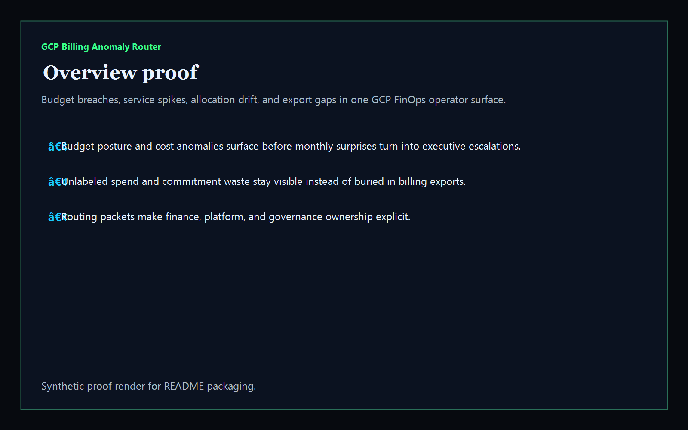
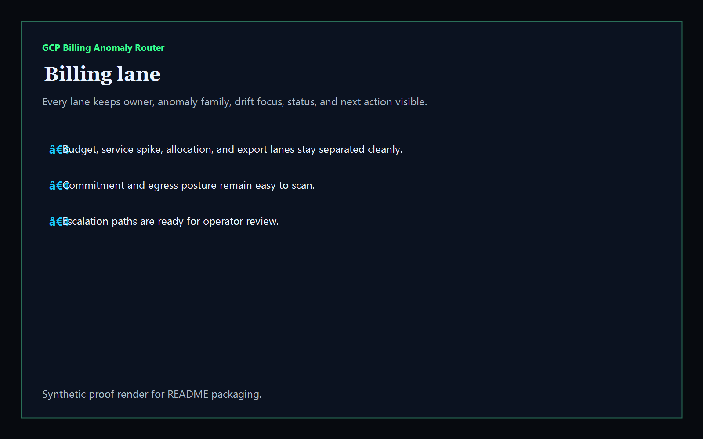
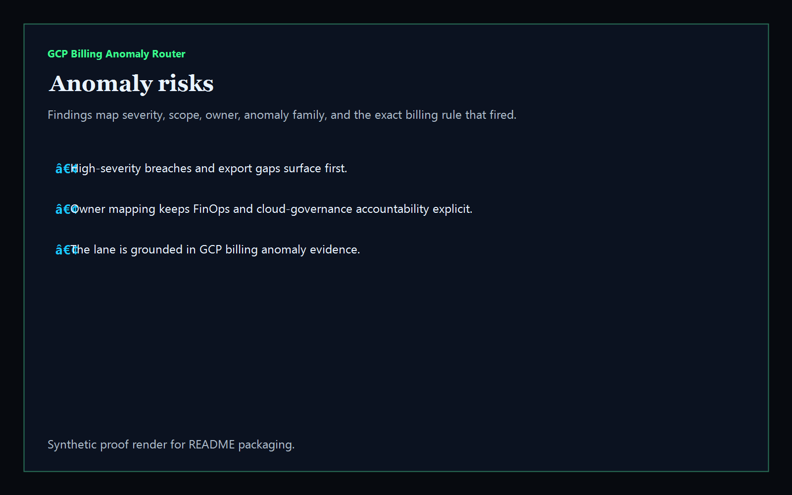
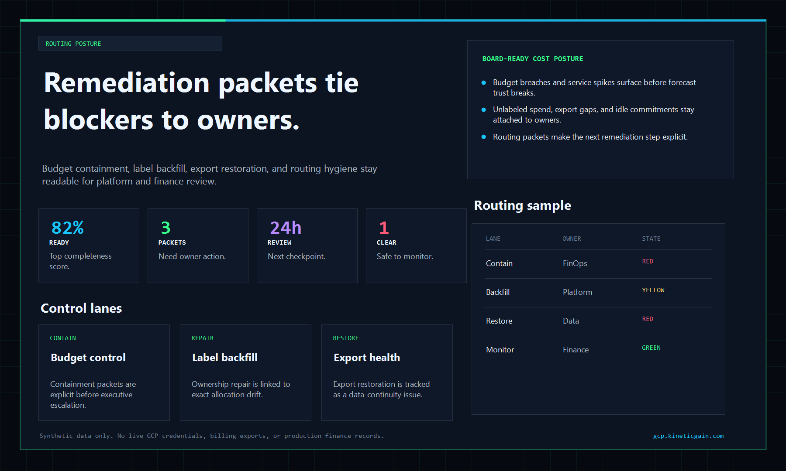

# gcp-billing-anomaly-router

[](https://github.com/mizcausevic-dev/gcp-billing-anomaly-router/actions/workflows/ci.yml)
[](./LICENSE)
[](https://github.com/mizcausevic-dev/gcp-billing-anomaly-router/actions/workflows/pages.yml)

Operator control plane for GCP billing anomalies, FinOps routing posture, budget breaches, unlabeled spend drift, billing export gaps, and remediation sequencing.

## Why this exists

- Billing exports become dangerous when cost spikes, egress bursts, and unlabeled spend stay trapped in raw CSVs instead of one operator-readable surface.
- Finance, platform, and cloud-governance teams need the same anomaly view before budgets, commitments, or dashboards drift out of trust.
- Recruiters looking for `GCP / billing / FinOps / anomaly routing / cloud cost` proof should see a real operator dashboard, not a keyword page.
- This repo turns GCP billing anomaly data into a control plane for budget pressure, service spikes, export health, and escalation posture.

## Why this matters (KG Embedded tie-back)

This repo demonstrates the GCP billing-and-routing control-plane primitive for cloud operations: cost spikes, anomaly triage, allocation drift, export health, and remediation packets in one operator surface. Kinetic Gain Embedded extends this pattern into productized in-app dashboards where platform, FinOps, and procurement teams need evidence-rich billing surfaces without exposing raw admin consoles or cloud credentials. See [kineticgain.com/embedded](https://kineticgain.com/embedded).

## What it shows

- `billing-lane` visibility for budget posture, service spikes, allocation hygiene, export coverage, and owner routing in one dashboard
- `anomaly-risks` detection for budget breaches, unlabeled spend, stale baselines, commitment drift, egress bursts, export gaps, and stale routing windows
- remediation packets for budget containment, label backfill, export restoration, and routing hygiene
- offline-safe analysis of captured GCP billing anomaly exports
- recruiter-facing GCP billing / FinOps / cost-governance proof that complements the Microsoft and AWS admin lanes

## Routes

- `/`
- `/billing-lane`
- `/anomaly-risks`
- `/routing-posture`
- `/verification`
- `/docs`

## API

- `/api/dashboard/summary`
- `/api/billing-lane`
- `/api/anomaly-risks`
- `/api/routing-posture`
- `/api/verification`
- `/api/sample`

## Screenshots






## CLI

```powershell
npx gcp-billing-anomaly-router fixtures/gcp-billing-anomalies.json `
    --format json|markdown|summary `
    --now 2026-05-30T00:00:00Z `
    --stale-routing-after-hours 24 `
    --fail-on-high `
    --out report.md
```

Input shape:

```json
{
  "baselines": [ ... ],
  "anomalies": [ ... ]
}
```

## Local Development

```powershell
cd gcp-billing-anomaly-router
npm install
npm run dev
```

Open:
- [http://127.0.0.1:5517/](http://127.0.0.1:5517/)
- [http://127.0.0.1:5517/billing-lane](http://127.0.0.1:5517/billing-lane)
- [http://127.0.0.1:5517/anomaly-risks](http://127.0.0.1:5517/anomaly-risks)
- [http://127.0.0.1:5517/routing-posture](http://127.0.0.1:5517/routing-posture)
- [http://127.0.0.1:5517/verification](http://127.0.0.1:5517/verification)

## Validation

- `npm run lint`
- `npm run typecheck`
- `npm run coverage`
- `npm run build`
- `npm run demo`
- `npm run smoke`
- `npm run prerender`
- `npm run render:assets`

## Production status

| Aspect | Status |
|--------|--------|
| CI | Node 20 + 22 matrix — lint · typecheck · coverage · build · demo · smoke · prerender · `npm audit` |
| License | [AGPL-3.0-or-later](./LICENSE) |
| Deploy | Static prerender -> **https://billing.kineticgain.com/** |
| Data posture | Synthetic sample data only; no live GCP credentials, project tokens, billing exports, or production finance dashboards |
| Suite | Part of the [Kinetic Gain Protocol Suite](https://suite.kineticgain.com/) operator portfolio · apex: [kineticgain.com](https://kineticgain.com) |

## Docs

- [Kinetic Gain Embedded tie-back](./docs/KINETIC_GAIN_EMBEDDED.md)
- [Changelog](./CHANGELOG.md)

## Composes with

- [**`entra-access-review-control-plane`**](https://github.com/mizcausevic-dev/entra-access-review-control-plane) — Microsoft Entra access reviews
- [**`intune-device-compliance-ops`**](https://github.com/mizcausevic-dev/intune-device-compliance-ops) — Intune device compliance
- [**`aws-iam-access-analyzer-console`**](https://github.com/mizcausevic-dev/aws-iam-access-analyzer-console) — AWS IAM analyzer posture
- [**`gcp-iam-policy-diff-lab`**](https://github.com/mizcausevic-dev/gcp-iam-policy-diff-lab) — GCP IAM drift and guardrail posture

Together they form a broader recruiter-facing cloud admin lane: Microsoft tenant governance plus AWS and GCP identity, cost, and control-plane proof.
